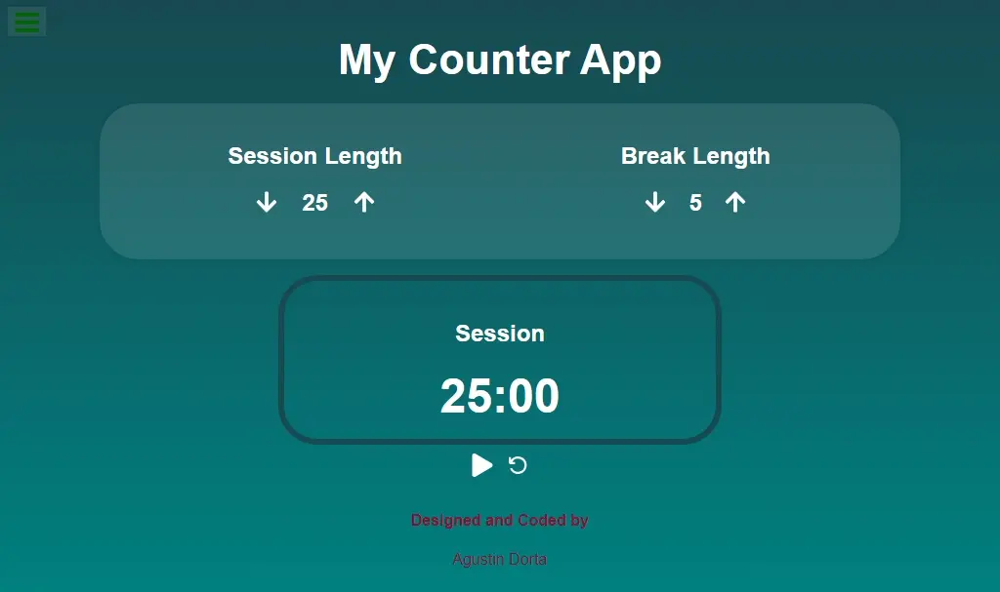

# ⏱ App Pomodoro

Cronómetro productivo con ciclos Pomodoro, botones de control, sonido de alerta y temporizador visual. Construida con HTML, styled-components y React..


## Demo

👉 [Demo](https://pomodoroapp25-o-clock.netlify.app/)


## Screenshots




## 🚀 Tecnologías utilizadas

- ⚛️ **React**
- ⚡ **Vite**
- 💨 **Tailwind CSS**
- 🧹 **ESLint** (linter)


## 📦 Instalación


1. Cloná el repositorio:

```bash
 git clone https://github.com/mordok22012/PomodoroApp.git
 cd PomodoroApp 
```
2. Instalá las dependencias:

```bash
 npm install
```
## 🔧 Scripts disponibles

- Ejecuta el servidor de desarrollo
```bash
 npm run dev
```


